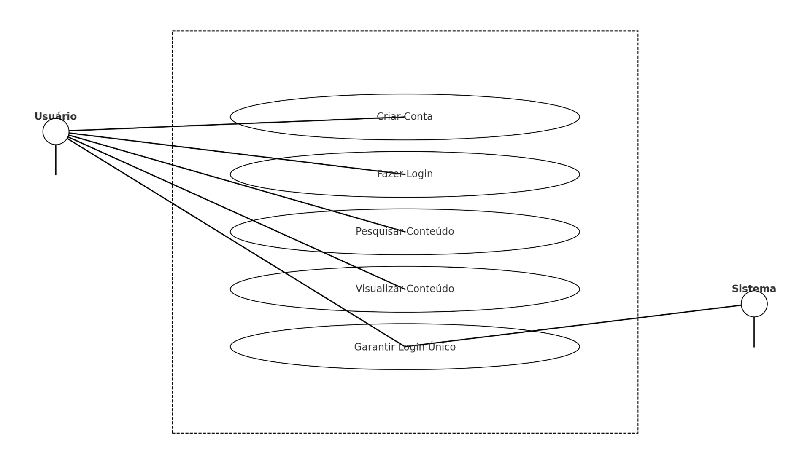

# Especificações do Projeto

## Problema
Usuários, sejam eles empresas, empreendedores ou afiliados, que enfrentam dificuldades em encontrar uma forma de vender seu serviço/produto utilizando-se de marketing de indicação

## Ideias de solução
Desenvolver um software de Multínivel que combina a facilidade de uso e que seja altamente intuitivo

## Personas

### 1.João de Olavo Mesquita

Idade: 20 anos.

Descrição: Empreendedor que quer aumentar as venda de projetos de energia solar.

Necessidade: Ferramenta que facilite a gestão de indicações do seu negócio.

Frustação: Dificuldade de indicar seus produtos através do marketing tradicional.

### 2. Livia Andrade Lemos

Idade: 31 Anos.

Descrição: Nova empreendedora no ramo de cosméticos.

Necessidade: Expandir sua rede de clientes na região.

Frustação: Dificuldade em adquirir novos clientes por ser nova no mercado.

### 3. Roberto de Souza Nascimento

Idade: 36 Anos.

Descrição: Estudante de Administração.

Necessidade: Ganhar uma renda extra através de um aplicativo mobile.

Frustação: Um aplicativo seguro e confiável que forneça remuneração.

<!-- ### 3.Instituto Mix - Mateus Leme

Descrição: Instituição tradicional buscando inovar no ambiente digital.

Necessidade: Ferramenta que facilite alunos indicarem outros alunos e serem remunerados por isso.-->

### 4.Instituto Mix - Mateus Leme

Idade: 45 anos desde sua fundação.

Descrição: Instituição tradicional buscando inovar no ambiente digital.

Necessidade: Ferramenta que facilite alunos indicarem outros alunos e serem remunerados por isso.

Frustação: Dificuldade para que os alunos recomendem ou indiquem a intituição para possíveis novos alunos.

## Histórias de Usuários

| EU COMO...                          | QUERO/PRECISO...                                              | PARA...                                                      |
|-------------------------------------|---------------------------------------------------------------|--------------------------------------------------------------|
| João, empreendedor jovem            | Gerenciar e rastrear as indicações feitas para meu negócio   | Otimizar meu marketing e aumentar as vendas de projetos de energia solar |
| Instituto Mix - Mateus Leme         | Implementar um sistema de recompensas para indicações de novos alunos | Incentivar os alunos atuais a trazerem mais inscrições e ampliar a base de estudantes |
| Instituto Mix - Mateus Leme         | Monitorar o sucesso e a eficácia das indicações              | Adaptar-se às tendências e entender quais estratégias são mais eficientes para a instituição |

## Requisitos

### Requisitos Funcionais

|ID    | Descrição do Requisito                                                                   | Prioridade |
|------|------------------------------------------------------------------------------------------|------------|
|RF-001| Permitir que o usuário crie sua conta                                                    | ALTA      |
|RF-002| Permitir que o usuário faça login                                                         | ALTA      |
|RF-003| Permitir que o usuário indique outras pessoas através de um link ou código único         | ALTA      |
|RF-004| Oferecer um sistema de gestão de indicações, mostrando quem indicou e quem foi indicado  | ALTA      |
|RF-005| Permitir a visualização de recompensas ou bonificações por indicações bem-sucedidas      | ALTA      |
|RF-006| Permitir que o usuário recupere sua senha                                                 | MÉDIA     |
|RF-007| Oferecer um painel com estatísticas de indicações (total, convertidas, pendentes)        | MÉDIA     |

### Requisitos não Funcionais

|ID     | Descrição do Requisito                                                   |Prioridade |
|-------|--------------------------------------------------------------------------|-----------|
|RNF-001| O sistema deve ser responsivo para rodar em dispositivos móveis          | ALTA      |
|RNF-002| O login deve ser seguro e encriptado                                     | ALTA      |
|RNF-003| A geração do link/código de indicação deve ser instantânea                | ALTA      |
|RNF-004| O sistema deve detectar e encerrar sessões simultâneas do mesmo usuário | MÉDIA     |
|RNF-005| Todos os dados de usuário devem ser armazenados de forma segura          | ALTA      |
|RNF-006| O sistema deve ter backups regulares e recuperação em caso de falhas     | ALTA      |
|RNF-007| Notificações por e-mail ou SMS quando uma indicação é convertida          | MÉDIA     |

## Restrições

|ID| Restrição                                                                 |
|--|---------------------------------------------------------------------------|
|01| O projeto deverá ser entregue até o final do semestre                     |
|02| O sistema não deve armazenar senhas em texto puro                         |
|03| O sistema deve ser capaz de suportar um mínimo de 10.000 usuários ativos  |
|04| O código da indicação deve expirar em 30 dias após a geração              |

# Arquitetura Distribuída Simplificada da Plataforma Educacional

## Visão Geral

A plataforma adota uma estrutura básica distribuída, focando na simplicidade e facilidade de manutenção.

## Componentes Principais

### 1. Frontend 
#### 1.1 Interface Web
- Interface para navegador construída em PHP.
- Conexão com o backend através de APIs simples.

#### 1.2 Interface Móvel
- Aplicativo para dispositivos móveis desenvolvido em React Native.
- Conexão direta com o backend via APIs simples.

### 2. Backend
- Desenvolvido em PHP.
- Processa as requisições da interface e gerencia as operações do banco de dados.

### 3. Banco de Dados MySQL
- Armazena informações de usuários e conteúdo da plataforma.

## Comunicação

As interfaces web e móvel se comunicam com o backend predominantemente através de APIs RESTful simples.

## Segurança

- Criptografia básica usando TLS/SSL para proteger a transmissão de dados.
- Autenticação de usuários para acesso ao sistema e conteúdo.
  
## Representação Gráfica da Arquitetura Do Projeto

## Diagrama de Casos de Uso

## Matriz de Rastreabilidade

| ID Requisito | Fonte do Requisito | Componentes Afetados | Testes Associados | Observações |
|--------------|--------------------|----------------------|-------------------|-------------|
|RF-001        | História de Usuário: João | Módulo de Registro | Teste de Criação de Conta | - |
|RF-002        | História de Usuário: João | Módulo de Login | Teste de Login | Verificar integração com criptografia |
|RF-003        | História de Usuário: João, Instituto Mix - Mateus Leme | Módulo de Indicações | Teste de Geração de Link/Código | - |
|RF-004        | História de Usuário: João, Instituto Mix - Mateus Leme | Módulo de Indicações | Teste de Listagem de Indicações | - |
|RF-005        | História de Usuário: Instituto Mix - Mateus Leme | Módulo de Recompensas | Teste de Visualização de Recompensas | - |
|RF-006        | - | Módulo de Login | Teste de Recuperação de Senha | - |
|RF-007        | História de Usuário: João, Instituto Mix - Mateus Leme | Módulo de Dashboard | Teste de Exibição de Estatísticas | - |
|RNF-001       | - | Módulo de UI/UX | Teste de Responsividade | Deve funcionar em dispositivos móveis e desktops |
|RNF-002       | - | Módulo de Login | Teste de Segurança no Login | Verificar uso de HTTPS e encriptação |
|RNF-003       | História de Usuário: João | Módulo de Indicações | Teste de Performance | Tempo de resposta esperado: <2s |
|RNF-004       | - | Módulo de Sessões | Teste de Sessão Simultânea | Detectar e encerrar sessões duplicadas |
|RNF-005       | - | Módulo de Banco de Dados | Teste de Segurança do Banco de Dados | Garantir encriptação e backups |
|RNF-006       | - | Módulo de Backup | Teste de Recuperação de Backup | Verificar integridade após restauração |
|RNF-007       | História de Usuário: Instituto Mix - Mateus Leme | Módulo de Notificações | Teste de Envio de Notificação | Verificar entrega de e-mail/SMS |

# Planejamento do Projeto

## Cronograma

| Atividade                             | Início      | Fim         | Duração |
|---------------------------------------|-------------|-------------|---------|
| Planejamento Inicial                  | 01/10/2023  | 07/10/2023  | 7 dias  |
| Design da Interface do Usuário       | 08/10/2023  | 21/10/2023  | 14 dias |
| Desenvolvimento da Base de Dados      | 22/10/2023  | 05/11/2023  | 15 dias |
| Implementação das Funcionalidades    | 06/11/2023  | 20/11/2023  | 15 dias |
| Testes Iniciais                       | 21/11/2023  | 30/11/2023  | 10 dias |
| Feedback e Iteração                   | 01/12/2023  | 10/12/2023  | 10 dias |
| Testes Finais e Ajustes               | 11/12/2023  | 20/12/2023  | 10 dias |

## Custos

| Item                                  | Custo Estimado  |
|---------------------------------------|-----------------|
| Hospedagem e infraestrutura           | R$100/mês       |

## Pessoal

| Cargo                        | Quantidade | Descrição                                           |
|------------------------------|------------|-----------------------------------------------------|
| Gerente de Projeto           | 2         | Responsável pela coordenação e supervisão do projeto |
| Desenvolvedor Front-end      | 2          | Criação e design da interface do usuário            |
| Desenvolvedor Back-end       | 2          | Implementação da lógica e gestão da base de dados    |
| Designer UX/UI               | 2          | Projetar a experiência do usuário                    |
| Testador                     | 2          | Responsável pelos testes de qualidade do software    |

