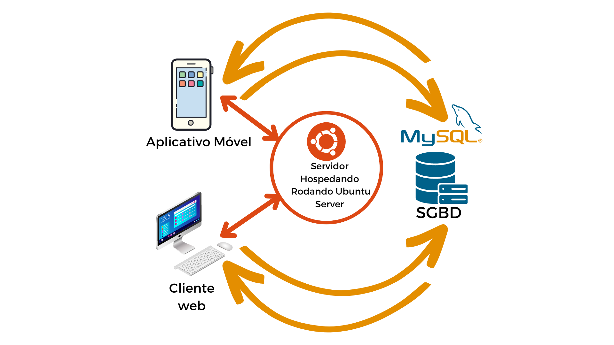

# Especificações do Projeto

## Problema
Usuários, sejam eles estudantes, instrutores ou instituições educacionais, enfrentam dificuldades em encontrar um espaço centralizado que ofereça uma experiência de aprendizado online semelhante às plataformas de streaming populares.

## Ideias de solução
Desenvolver um software de streaming educacional que combina a facilidade de uso das plataformas de entretenimento com a flexibilidade do aprendizado online, tudo por meio de uma assinatura mensal.

## Personas

### 1.João

Idade: 20 anos.

Descrição: Estudante universitário que busca complementar sua formação.

Necessidade: Conteúdo educacional diversificado e de qualidade.

### 2.Maria

Idade: 35 anos.

Descrição: Professora que deseja expandir seu alcance online.

Necessidade: Plataforma simples para hospedar seus cursos.

### 3.Instituto Mix - Mateus Leme

Descrição: Instituição tradicional buscando inovar no ambiente digital.

Necessidade: Ferramenta que facilite a transição do ensino presencial para o digital.

## Histórias de Usuários

|EU COMO... `PERSONA`               | QUERO/PRECISO ... `FUNCIONALIDADE`                                 |PARA ... `MOTIVO`                                        |
|----------------------------------|---------------------------------------------------------------------|--------------------------------------------------------------|
|João, estudante universitário     | Acessar conteúdo educacional diversificado                          | Complementar minha formação com qualidade                    |
|Maria, professora                 | Ter uma plataforma simples para hospedar meus cursos                | Expandir meu alcance e ensinar online de forma eficiente     |
|Instituto Mix - Mateus Leme       | Utilizar uma ferramenta que facilite a transição para ensino digital| Inovar e adaptar-se às demandas atuais de ensino             |

## Requisitos

### Requisitos Funcionais

|ID    | Descrição do Requisito                                                | Prioridade |
|------|-----------------------------------------------------------------------|------------|
|RF-001| Permitir que o usuário crie sua conta                                 | ALTA      |
|RF-002| Permitir que o usuário faça login                                      | ALTA      |
|RF-003| Oferecer um sistema de busca para o usuário encontrar conteúdo desejado | ALTA      |
|RF-004| Permitir que o usuário acesse apenas uma sessão por vez                | ALTA      |
|RF-005| Permitir que o usuário recupere sua senha                              | MÉDIA     |

### Requisitos não Funcionais

|ID     | Descrição do Requisito                                               |Prioridade |
|-------|----------------------------------------------------------------------|-----------|
|RNF-001| O sistema deve ser responsivo para rodar em dispositivos móveis      | ALTA      |
|RNF-002| O login deve ser seguro e encriptado                                 | ALTA      |
|RNF-003| O sistema de busca deve retornar resultados em no máximo 2 segundos  | ALTA      |
|RNF-004| O sistema deve detectar e encerrar sessões simultâneas do mesmo usuário | MÉDIA |
|RNF-005| Todos os dados de usuário devem ser armazenados de forma segura      | ALTA      |

## Restrições

|ID| Restrição                                               |
|--|---------------------------------------------------------|
|01| O projeto deverá ser entregue até o final do semestre   |
|02| O sistema não deve armazenar senhas em texto puro       |

# Arquitetura Distribuída Simplificada da Plataforma Educacional

## Visão Geral

A plataforma adota uma estrutura básica distribuída, focando na simplicidade e facilidade de manutenção.

## Componentes Principais

### 1. Frontend 
#### 1.1 Interface Web
- Interface para navegador construída em PHP.
- Conexão com o backend através de APIs simples.

#### 1.2 Interface Móvel
- Aplicativo para dispositivos móveis desenvolvido em React Native.
- Conexão direta com o backend via APIs simples.

### 2. Backend
- Desenvolvido em PHP.
- Processa as requisições da interface e gerencia as operações do banco de dados.

### 3. Banco de Dados MySQL
- Armazena informações de usuários e conteúdo da plataforma.

### 4. Servidor de Vídeo Aulas
- Dedicado para armazenar e servir vídeo aulas.

## Comunicação

As interfaces web e móvel se comunicam com o backend predominantemente através de APIs RESTful simples.

## Segurança

- Criptografia básica usando TLS/SSL para proteger a transmissão de dados.
- Autenticação de usuários para acesso ao sistema e conteúdo.
  
## Representação Gráfica da Arquitetura Do Projeto

## Diagrama de Casos de Uso

O diagrama de casos de uso é o próximo passo após a elicitação de requisitos, que utiliza um modelo gráfico e uma tabela com as descrições sucintas dos casos de uso e dos atores. Ele contempla a fronteira do sistema e o detalhamento dos requisitos funcionais com a indicação dos atores, casos de uso e seus relacionamentos. 

As referências abaixo irão auxiliá-lo na geração do artefato “Diagrama de Casos de Uso”.

> **Links Úteis**:
> - [Criando Casos de Uso](https://www.ibm.com/docs/pt-br/elm/6.0?topic=requirements-creating-use-cases)
> - [Como Criar Diagrama de Caso de Uso: Tutorial Passo a Passo](https://gitmind.com/pt/fazer-diagrama-de-caso-uso.html/)
> - [Lucidchart](https://www.lucidchart.com/)
> - [Astah](https://astah.net/)
> - [Diagrams](https://app.diagrams.net/)

# Matriz de Rastreabilidade dos Requisitos

| ID Requisito | Descrição                                          | Casos de Uso Associados |
|--------------|----------------------------------------------------|-------------------------|
| RF-001       | Permitir que o usuário crie sua conta              | UC-001                  |
| RF-002       | Permitir que o usuário faça login                  | UC-002                  |
| RF-003       | Permitir que o usuário encontre o conteúdo desejado| UC-003, UC-004          |
| RF-004       | Garantir que o usuário logue em apenas uma sessão | UC-005                  |
| RNF-001      | O sistema deve ser responsivo                      | UC-006                  |
| RNF-002      | Resposta de requisição em no máximo 2s             | UC-007                  |

# Planejamento do Projeto

## Cronograma

| Atividade                             | Início      | Fim         | Duração |
|---------------------------------------|-------------|-------------|---------|
| Planejamento Inicial                  | 01/10/2023  | 07/10/2023  | 7 dias  |
| Design da Interface do Usuário       | 08/10/2023  | 21/10/2023  | 14 dias |
| Desenvolvimento da Base de Dados      | 22/10/2023  | 05/11/2023  | 15 dias |
| Implementação das Funcionalidades    | 06/11/2023  | 20/11/2023  | 15 dias |
| Testes Iniciais                       | 21/11/2023  | 30/11/2023  | 10 dias |
| Feedback e Iteração                   | 01/12/2023  | 10/12/2023  | 10 dias |
| Testes Finais e Ajustes               | 11/12/2023  | 20/12/2023  | 10 dias |

## Custos

| Item                                  | Custo Estimado  |
|---------------------------------------|-----------------|
| Salários da equipe de desenvolvimento | R$24,00/mês        |
| Hospedagem e infraestrutura           | R$100/mês       |
| Licenças de Cursos                    | R$5.000          |
| Marketing e Publicidade               | R$15.000/mês          |
| Outros (imprevistos, taxas, etc.)     | R$800           |
| **Total Estimado**                    | **R$20.924**     |

## Pessoal

| Cargo                        | Quantidade | Descrição                                           |
|------------------------------|------------|-----------------------------------------------------|
| Gerente de Projeto           | 2         | Responsável pela coordenação e supervisão do projeto |
| Desenvolvedor Front-end      | 2          | Criação e design da interface do usuário            |
| Desenvolvedor Back-end       | 2          | Implementação da lógica e gestão da base de dados    |
| Designer UX/UI               | 2          | Projetar a experiência do usuário                    |
| Testador                     | 2          | Responsável pelos testes de qualidade do software    |

